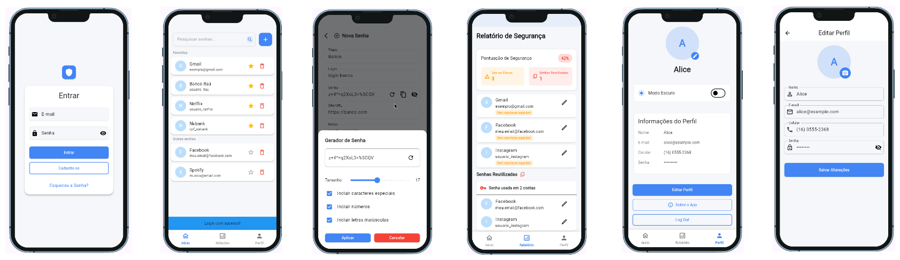

# 🔐 Blindex

**Blindex** é um aplicativo mobile desenvolvido em **Flutter** que funciona como um gerenciador de senhas seguro, prático e fácil de usar. Com ele, você pode armazenar, organizar e acessar suas credenciais com segurança, tudo em um só lugar.

---

## 📱 Demonstração

> 📸 *Veja abaixo uma prévia do aplicativo em funcionamento:*

  

---

## 🛠️ Tecnologias Utilizadas

- **Flutter**
- **Dart**
- **Provider**
- **GetIt**
- **Material Design**
- **BCRYPT**

---

## ✨ Funcionalidades

- Armazenamento seguro de senhas
- Geração de senhas fortes
- Pesquisa por nome de serviço
- Interface amigável e responsiva

---

## 🚀 Como executar

1. Clone o repositório:

   ```bash
   git clone https://github.com/seu-usuario/blindex.git
   cd blindex
   ```

2. Instale as dependências:

   ```bash
   flutter pub get
   ```

3. Rode o app:

   ```bash
   flutter run
   ```

---

## 🔒 Segurança

Blindex utiliza criptografia com Bcrypt para garantir que suas senhas estejam protegidas mesmo que o dispositivo seja perdido ou acessado por terceiros.

---

## 📌 Roadmap

- [ ] Integração com autenticação por face/biometria
- [ ] Autenticacão com google
- [ ] Exportação e importação de senhas
- [ ] Gerenciamento dos dados com firebase
- [ ] Criptografar as senhas criadas pelos usuarios

---

## 🤝 Contribuindo

Contribuições são bem-vindas! Sinta-se à vontade para abrir issues ou enviar pull requests.

---

## 👨‍💻 Criado por

- **Lucas Bueno Ricardo**  
  📧 [lucas.ricardo@fatec.sp.gov.br](mailto:lucas.ricardo@fatec.sp.gov.br)  
  🎓 RA: 2840482323001


- **Gustavo Miguel Santana**  
  📧 [gustavo.santana19@fatec.sp.gov.br](mailto:gustavo.santana19@fatec.sp.gov.br)  
  🎓 RA: 2840482323004

---